# Fraud Detection at Bank Account Opening

Banks get hit by fraud at the application stage itself, someone submits fake or stolen identity details, gets approved, and the damage is done before any transaction even happens. I built a system that scores each application the moment it comes in and flags it as fraud or not. The decision threshold is set using real industry cost data rather than an arbitrary cutoff, and every prediction comes with a SHAP explanation showing exactly which signals drove the decision.


---

## The Problem

Bank account fraud happens at the application stage, before any transaction occurs. A fraudster submits an application with fabricated or stolen identity details, gets approved, and uses the account for money laundering, synthetic identity fraud, or credit abuse. By the time traditional transaction monitoring catches it, the damage is already done.

The challenge is that only about 1 in 100 applications is fraudulent. A naive model that approves everything would be 98.9% accurate and completely useless. The real problem is building a system that catches fraud reliably while keeping false alarms low enough that legitimate customers are not disrupted, and doing this in a way that is financially justified rather than arbitrary.

This project builds that system end-to-end: from raw application data to a trained model evaluated at a threshold derived from real industry cost benchmarks, with per-prediction explanations that show exactly which signals drove each decision.

---

## Dataset

**Bank Account Fraud (BAF) Dataset** - NeurIPS 2022  
Source: IEEE DataPort / [BAF Dataset Repository](https://github.com/feedzai/bank-account-fraud)

The dataset is not included in this repository due to size. Download `Base.csv` from the source above and place it at `main/Base.csv`.

| Property | Value |
|---|---|
| Total applications | 1,000,000 |
| Fraud cases | 11,029 (1.10%) |
| Features | 30 raw, 47 after engineering and encoding |
| Time span | 8 months (month 0 to month 7) |
| Split | Months 0-5 train / Months 6-7 test |

Each row is one bank account application. Features come from two sources: applicant-submitted fields (income, employment, housing) and backend signals pulled automatically (credit bureau score, address history, bank relationship duration, session behaviour, device signals).

---

## Exploratory Data Analysis

Before any modeling, the dataset was profiled to understand fraud distribution across features, identify data quality issues, and inform preprocessing decisions.

**Class imbalance:** 11,029 fraud cases out of 1,000,000 applications gives a 1.10% fraud rate. This is the central challenge. Any model trained without accounting for it will learn to predict "legitimate" for everything and achieve 98.9% accuracy while catching zero fraud.

**Sentinel values:** Three columns use -1 as a sentinel for "not provided": `prev_address_months_count`, `current_address_months_count`, and `bank_months_count`. These are not missing at random. Applicants who do not provide address or banking history are disproportionately associated with fraud. Treating -1 as a numeric value causes the model to order it below 0 months, which is meaningless. The `has_prev_address` feature was engineered specifically to handle this cleanly.

**Fraud rate by housing status:**

| Housing Type | Fraud Rate |
|---|---|
| Private Renter (BA) | 3.52% (highest) |
| Temporary Accommodation (BD) | ~2.8% |
| Social Housing (BF) | ~2.1% |
| Owner with Mortgage (BC) | ~0.6% |
| Outright Owner (BB) | ~0.4% (lowest) |

Private renters have roughly 6x the fraud rate of outright homeowners. This is why `housing_status_BA` dominates both gain-based and SHAP importance rankings. It is the single most discriminating categorical signal in the dataset.

**Fraud rate by employment status:** Unemployed and retired applicants show elevated fraud rates compared to full-time employed. Students show the lowest rates, consistent with lower credit limits being targeted.

**Digital signals:** `keep_alive_session`, `phone_home_valid`, and `email_is_free` all show clear separation between fraud and legitimate distributions. Fraudsters are significantly more likely to use free email providers, have no valid landline, and show dropped session behaviour, consistent with scripted or bot-driven application submissions.

**Temporal stability:** Fraud rates remain consistent across all 8 months with no dramatic spikes. The temporal split is clean. The model trained on months 0-5 is evaluated on data with the same underlying fraud characteristics, just at a later time point.

---

## Feature Engineering

Two features were created from the raw columns.

**`has_prev_address`**

The raw column `prev_address_months_count` uses -1 as a sentinel for "no prior address on record." The problem with using it directly is that a tree split like `prev_address_months_count < 5` would treat "4 months at current address" and "no prior address at all" the same way. Both fall on the same side, and -1 makes having no address history look better than having 0 months, which is backwards.

The fix is a binary flag: `has_prev_address = (prev_address_months_count != -1)`. This gives the model a clean signal asking simply whether the applicant has any traceable address history at all. The continuous duration is kept alongside it for cases where duration itself matters. The feature ranks 5th in gain-based importance and 10th in SHAP, confirming it added real signal.

**`credit_to_income_ratio`**

Formula: `proposed_credit_limit / (income + 1)`

A fraudster often requests a high credit limit because that is the target. They may simultaneously declare low income because the income is fabricated and a large number draws scrutiny. The ratio captures this pattern. A $10,000 request on $15,000 income looks very different from the same request on $80,000 income, even though the raw credit limit is identical. The +1 prevents division by zero for zero-income rows.

---

## Project Structure

```
Early Fraud Signal System for Bank Account Openings/
├── README.md
├── .gitignore
└── main/
    ├── Base.csv                        <- raw dataset (download separately, not in repo)
    └── code/
        ├── requirements.txt
        ├── src/
        │   ├── preprocess.py           <- cleaning, feature engineering, splitting, scaling
        │   ├── train.py                <- RF baseline, XGBoost (spw), XGBoost (SMOTE)
        │   ├── evaluate.py             <- metrics, plots, failure analysis, drift check
        │   └── explain.py              <- SHAP global importance + per-prediction waterfalls
        ├── models/
        │   └── README.md               <- instructions to reproduce .pkl files
        └── outputs/
            └── figures/                <- all generated plots (14 PNG files)
```

---

## Pipeline

The pipeline runs in four sequential steps. Each step saves its outputs so the next step can load them independently.

```
preprocess.py  ->  train.py  ->  evaluate.py  ->  explain.py
```

---

### Step 1 : Preprocessing (`preprocess.py`)

**Why temporal split and not random:**
A random split would shuffle month 7 applications into training and month 0 applications into test. In production, a model trained today scores applications arriving tomorrow and will never have seen those future applications. A random split leaks future patterns into training and produces inflated metrics that do not reflect real-world performance. The temporal split enforces the real-world boundary: months 0-5 train (794,802 rows), months 6-7 test (205,198 rows).

**Columns dropped:**

| Column | Reason |
|---|---|
| `velocity_6h`, `velocity_24h`, `velocity_4w` | Synthetic perturbation caused inverted order. The 6-hour mean was higher than the 4-week mean, which is physically impossible. Values also included negatives. |
| `velocity_ratio` | Engineered from velocity columns. Dropped with them. |
| `zip_count_4w` | Up to 6,700 applications per ZIP code in 4 weeks. A clear synthetic artifact, not real geography. |
| `bank_branch_count_8w` | Up to 2,385 branch visits in 8 weeks. Impossible in reality. |
| `device_fraud_count` | Entire column is 0 across all 1 million rows. Zero variance, zero signal. |
| `is_dirty_device` | Binary flag derived from `device_fraud_count`. Also all 0. |

**Scaler leakage prevention:**
Three columns (`days_since_request`, `session_length_in_minutes`, `intended_balcon_amount`) were MinMax scaled. The scaler was fitted on training data only and then applied to the test set using those training statistics. Fitting on the full dataset first would mean the test set's distribution influenced how training data was scaled. In production, a scaler trained in month 5 has no knowledge of month 7's distribution. Fitting only on train enforces this constraint.

---

### Step 2 : Model Selection and Training (`train.py`)

**Why XGBoost over LightGBM:**
LightGBM was a valid alternative and would likely produce comparable performance on this dataset. XGBoost was chosen for three specific reasons. First, its native `pred_contribs=True` computes exact SHAP values inside the booster without needing the standalone shap library, which avoids version conflicts and is faster. Since SHAP explainability was a core system requirement, this was a meaningful technical advantage. Second, `scale_pos_weight` behavior is well-documented for fraud detection use cases. Third, at 1 million rows with 47 features, XGBoost with `tree_method="hist"` is already fast enough. LightGBM's main advantage is speed on very large or high-dimensional datasets where the difference here would not change any results.

**Why three models:**
With an 89:1 class imbalance, a model trained naively learns to predict everything as legitimate because the majority class dominates the loss. Three different imbalance strategies were compared to isolate what actually drives performance improvement.

**Random Forest : naive baseline:**
No imbalance handling, no tuning, 100 estimators at default settings. It establishes a lower bound and confirms that the XGBoost gains come from imbalance handling rather than just from switching algorithms.

**XGBoost with `scale_pos_weight` - primary model:**
`scale_pos_weight = 989,971 / 11,029 = 89.7` weights each fraud case 89.7x more than a legitimate case during gradient updates. The model is penalized far more heavily for missing fraud than for wrongly flagging a legitimate application. No data modification takes place. The original data distribution is preserved and only the loss function is adjusted. This is the production-aligned approach.

**XGBoost with SMOTE : alternative:**
SMOTE (Synthetic Minority Oversampling Technique) creates synthetic fraud samples by interpolating between existing fraud cases in feature space, bringing the training class ratio to approximately 10:1. Applied to training data only. The test set is never modified so evaluation reflects the true real-world distribution. Evaluated as an alternative to `scale_pos_weight` to determine whether data-level rebalancing outperforms loss-level reweighting.

**Hyperparameter tuning:**
Both XGBoost variants used `GridSearchCV` with 3-fold `StratifiedKFold`, scoring on recall.

```python
param_grid = {
    "n_estimators":     [200, 400],
    "max_depth":        [4, 6],
    "learning_rate":    [0.05, 0.1],
    "subsample":        [0.8],
    "colsample_bytree": [0.8],
}
```

Stratified K-Fold was used because with 1.1% fraud, random folds can produce near-zero fraud cases per fold, making cross-validation scores meaningless. Stratified folding guarantees each fold matches the full dataset's fraud rate. Recall was the scoring metric because missing fraud is significantly more costly than a false alarm.

---

### Step 3 : Evaluation (`evaluate.py`)

**Why not threshold 0.5:**
The default 0.5 threshold assumes balanced classes. On an imbalanced fraud dataset, predicted fraud probabilities are naturally suppressed because the model has seen far more legitimate cases during training. At 0.5, the model classifies almost everything as legitimate. The threshold has to be set at a point that reflects the actual operating requirement rather than a statistical convention.

**Metrics used:**

| Metric | What it measures | Why it matters |
|---|---|---|
| **Recall** | Of all actual fraud, what fraction was caught | Primary metric. A missed fraud case is a direct financial loss. |
| **Precision** | Of flagged applications, what fraction are actually fraud | Measures the cost of false alarms to legitimate customers |
| **F1** | Harmonic mean of recall and precision | Balanced summary when both directions matter |
| **ROC-AUC** | Model's ability to separate fraud from legit across all thresholds | Threshold-independent. 0.5 is random, 1.0 is perfect. |
| **PR-AUC** | Area under the precision-recall curve | More informative than ROC-AUC under severe class imbalance |
| **Gini** | 2 x ROC-AUC minus 1 | Standard banking industry metric, normalized to 0-1 |
| **KS Statistic** | Maximum separation between fraud and legit score distributions | Measures how cleanly the model pushes the two populations apart |

**Overfitting check:**
Train ROC-AUC was 0.9045 and test ROC-AUC was 0.8915. The gap of 0.013 is within acceptable range. The model generalizes to unseen data.

**Failure mode analysis:**
`false_negatives.csv` and `false_positives.csv` are saved for manual inspection. Key feature averages between caught and missed fraud are compared to identify systematic patterns in where the model fails, which is more actionable than just knowing the aggregate miss rate.

**Temporal drift check:**
Performance is evaluated separately on month 6 and month 7. A model that degrades from month 6 to month 7 has learned patterns that became stale, which is a critical check for any time-ordered dataset.

---

### Step 4 : Explainability (`explain.py`)

**Why gain-based feature importance is not sufficient:**
XGBoost's native gain-based importance measures how much each feature improves the loss when used in a split, averaged across all trees. It is biased toward features used in early splits and toward high-cardinality features. It gives no direction (you cannot tell whether a feature increases or decreases fraud probability) and most critically, it is a global average that says nothing about any individual prediction.

**What SHAP does differently:**
SHAP (SHapley Additive exPlanations) comes from cooperative game theory. Each feature is treated as a player contributing to the final prediction outcome. SHAP fairly distributes the prediction among all features by considering every possible ordering and measuring each feature's marginal contribution. This produces three things that gain-based importance cannot:

1. **Direction** - each SHAP value is signed. Positive means it pushed the score toward fraud, negative means toward legitimate.
2. **Per-prediction magnitude** - not a dataset average, but the exact contribution for this specific application.
3. **Additivity** - base_value plus the sum of all SHAP values equals the final model output. Every fraction of the score is traceable to a specific feature.

XGBoost's native `pred_contribs=True` computes exact SHAP values inside the booster with no approximation and no external library dependency.

---

## Threshold Decision

**The problem with a fixed FPR threshold:**
A 5% FPR threshold is a common starting point but it is arbitrary. It does not account for the fact that different types of errors carry very different financial consequences.

**Cost-based derivation:**
Each error type was assigned a dollar cost based on published industry benchmarks:

- **False Negative (missed fraud):** $1,000 based on ACFE 2024 Report to the Nations, average loss per bank fraud case
- **False Positive (wrongly flagged legitimate):** $20 based on LexisNexis 2023 True Cost of Fraud, manual review cost per flagged application

The 50:1 cost ratio means missing one fraud case costs as much as wrongly blocking 50 legitimate customers. The optimal threshold minimizes total expected cost across the test set, which works out to **0.5187 (51.87%)**.

**Comparison at both operating points:**

| Threshold | Recall | FPR | TNR | TP | FN | FP | Net Benefit |
|---|---|---|---|---|---|---|---|
| 5% FPR (0.7648) | 54.2% | 5.0% | 95.0% | 1,561 | 1,317 | 10,106 | $41,880 |
| Cost-based (0.5187) | 78.3% | 15.8% | 84.2% | 2,254 | 624 | 32,007 | $989,860 |

The cost-based threshold catches 693 additional fraud cases and reduces missed fraud by 52.6%. Net benefit is approximately 23x higher. The higher false positive rate is the deliberate, financially rational tradeoff. At a 50:1 cost ratio, operating at 5% FPR leaves $947,980 of recoverable benefit unused.

---

## Results

| Model | ROC-AUC | PR-AUC | Recall | Gini | KS |
|---|---|---|---|---|---|
| Random Forest (baseline) | 0.825 | 0.149 | 0.644 | 0.651 | 0.535 |
| XGBoost (SMOTE) | 0.887 | 0.177 | 0.734 | 0.774 | 0.619 |
| XGBoost (scale_pos_weight) | **0.891** | **0.189** | **0.783** | **0.783** | **0.630** |

All metrics at each model's cost-based threshold on the 205,011-application test set.

**TNR: 84.2%** - 84.2% of legitimate applicants are correctly approved at the cost-based operating point.

---

## Visualizations

All figures are generated and saved to `main/code/outputs/figures/` when the pipeline is run.

---

### ROC Curve

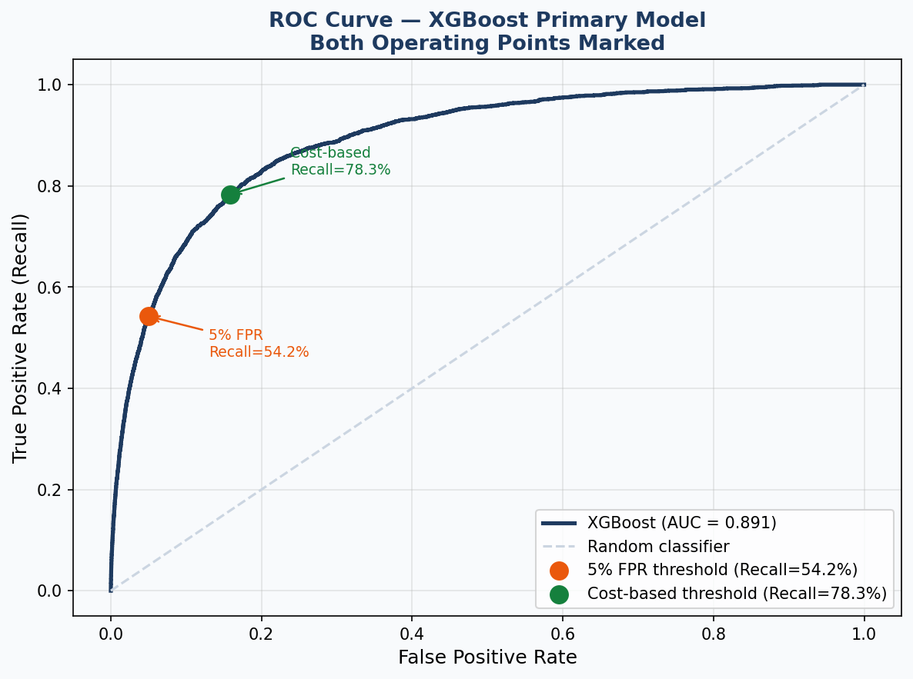

The ROC curve plots True Positive Rate (Recall) against False Positive Rate at every possible threshold. An AUC of 0.891 confirms genuine discriminatory power well above the random classifier diagonal.

Two operating points are marked. The orange dot at 5% FPR yields Recall=54.2%. The green dot at the cost-based threshold yields Recall=78.3% at FPR=15.8%. The gap between the two dots shows what is gained by moving from an arbitrary FPR cap to a cost-justified threshold: a substantial increase in fraud caught with a deliberate and financially justified shift along the curve.

---

### Precision-Recall Curve

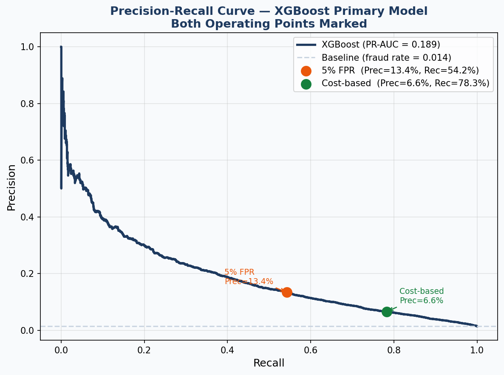

The PR curve is more informative than the ROC curve under severe class imbalance. With 1.4% fraud in the test set, the random baseline sits at precision=0.014. The model's PR-AUC of 0.189 is a 13.5x improvement over random.

The two operating points make the tradeoff explicit. The 5% FPR point achieves Precision=13.4% at Recall=54.2%. The cost-based threshold gives Recall=78.3% at Precision=6.6%. The precision drop is the cost of catching more fraud. More flags means a lower fraction of those flags are genuine. Whether that tradeoff is acceptable is not a statistical question. It depends entirely on the relative cost of each error type.

---

### Threshold Analysis and Net Benefit

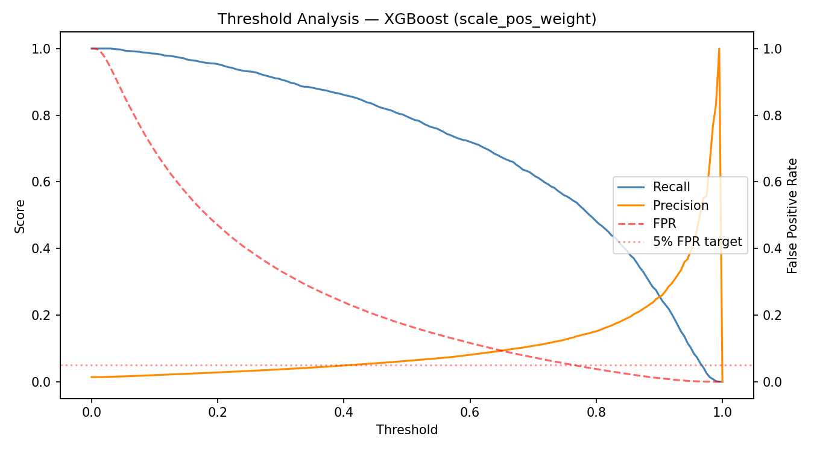

Two charts stacked vertically. The top chart shows how Recall (green) and FPR (orange) move as the threshold slides from 0 to 1. As the threshold increases, the model becomes more conservative and both recall and FPR drop together. The dashed vertical line marks the cost-based threshold at 0.5187.

The bottom chart shows net financial benefit at every threshold, calculated as (TP x $1,000) minus (FP x $20). The curve rises, peaks, and then declines. Setting the threshold too low flags so many legitimate applications that review costs erode the fraud savings. The two marked points confirm: $41,880 at 5% FPR versus $989,860 at the cost-based threshold. The peak of the curve validates that 0.5187 is close to the mathematically optimal operating point.

---

### Confusion Matrix Comparison

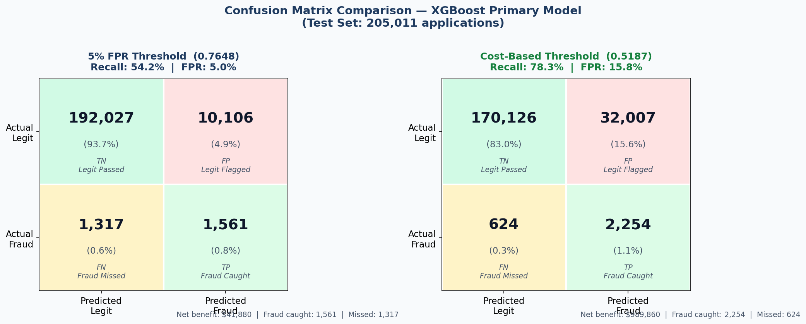

Side-by-side confusion matrices for the same XGBoost model at two thresholds on the 205,011-application test set. The model is identical. Only the operating point changes. This is the clearest illustration that threshold selection is a business decision, not a technical one.

At the 5% FPR threshold (0.7648): 1,561 fraud cases caught, 1,317 missed, 10,106 legitimate applications wrongly flagged. Net benefit: $41,880.

At the cost-based threshold (0.5187): 2,254 fraud cases caught, 624 missed, 32,007 legitimate applications flagged. Net benefit: $989,860.

The right matrix catches 693 more fraud cases at the cost of 21,901 additional false positives. At $1,000 per missed fraud and $20 per false positive, this is the rational operating point.

---

### Cost-Benefit Comparison

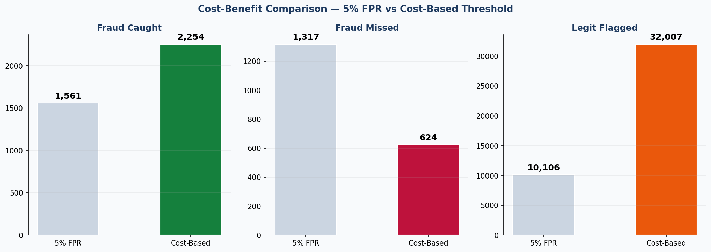

Three bar pairs comparing both thresholds across the three outcomes that determine financial impact.

Fraud caught: cost-based catches 44% more (2,254 vs 1,561). Fraud missed: cost-based misses 53% fewer (624 vs 1,317). Legit flagged: cost-based flags 3.2x more (32,007 vs 10,106).

Catching 693 more fraud cases saves $693,000 in prevented losses. The 21,901 additional false positives cost $438,020 in review. Net improvement from the threshold shift alone: $254,980, on top of the substantial base benefit already present at the 5% FPR point.

---

### Feature Importance - Gain vs SHAP

**XGBoost Gain-Based Importance:**

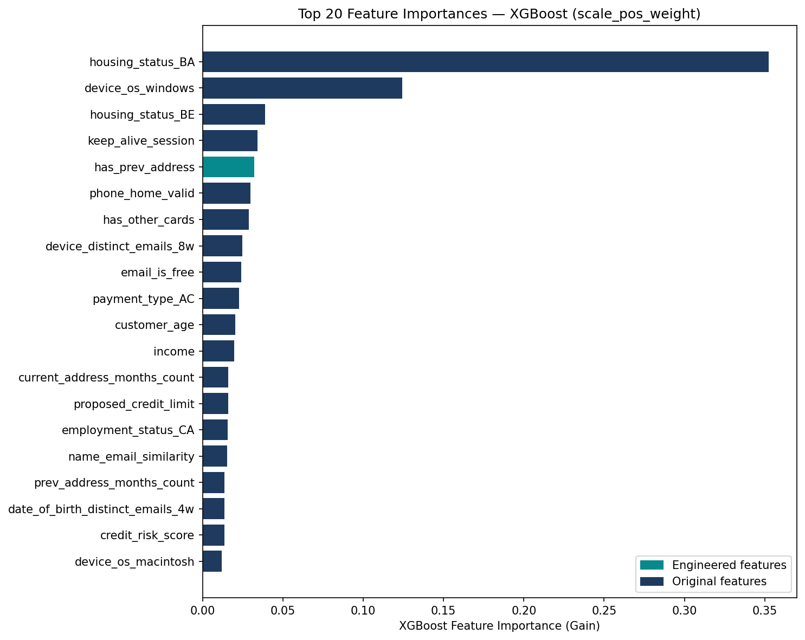

`housing_status_BA` (private renter) dominates at ~0.35 gain, more than twice the second-ranked feature. `device_os_windows` is second at ~0.13. After these two, the remaining features cluster near zero. The engineered feature `has_prev_address` (highlighted in teal) ranks 5th, confirming the feature engineering added real signal. However, gain-based importance is biased toward features used in early splits and toward binary or categorical features. Continuous features like `name_email_similarity` and `credit_risk_score` appear deceptively low here.

**SHAP Global Importance:**

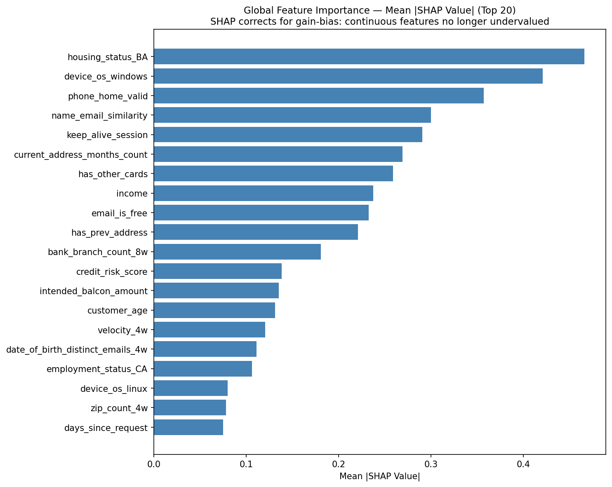

Mean absolute SHAP values give a fairer and unbiased measure of feature importance. The same top features appear, but the gap between them is much smaller than gain suggests. `housing_status_BA` (~0.50) and `device_os_windows` (~0.44) still lead, but `phone_home_valid` (~0.37), `name_email_similarity` (~0.29), `has_other_cards` (~0.29), `keep_alive_session` (~0.28), and `current_address_months_count` (~0.28) all rank meaningfully. These are features that gain-based importance was suppressing. It confirms that the gain metric was undervaluing the identity-verification and behavioral features that are genuinely important for fraud detection.

---

### SHAP Beeswarm : Direction of Impact

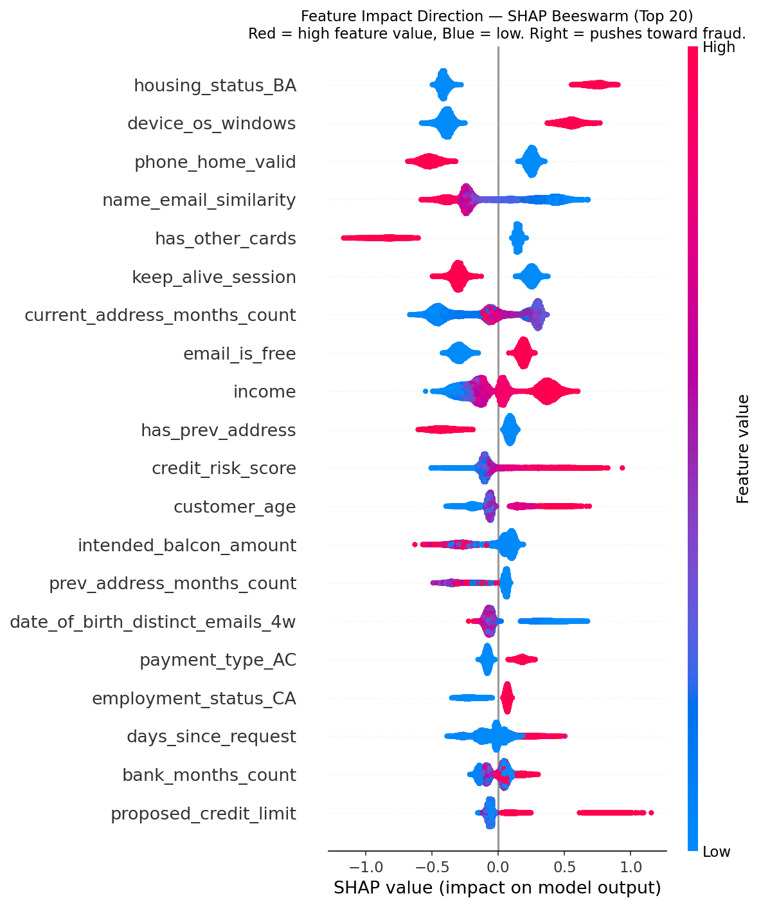

Each dot is one test sample. Horizontal position shows SHAP value magnitude and direction (right pushes toward fraud, left pushes toward legitimate). Color shows the feature's actual value (red is high, blue is low).

Key patterns:

- `housing_status_BA`: red dots (private renter, value=1) cluster strongly right. Blue dots (not a private renter) push left. Being a private renter is the single strongest individual fraud signal in the dataset.
- `phone_home_valid`: red dots (valid landline=1) push left strongly. A verifiable landline is a legitimacy signal. Having no valid landline pushes right toward fraud.
- `name_email_similarity`: red dots (high similarity, name matches email) push left. Low similarity pushes right and is indicative of fabricated identity.
- `has_other_cards`: red dots (existing credit relationships=1) push left strongly. Existing credit history is one of the most reliable legitimacy signals.
- `keep_alive_session`: red dots (session stayed active) push left. A session that drops mid-application is consistent with bot-driven submission.

---

### SHAP Waterfall : True Positive (Correctly Caught Fraud)

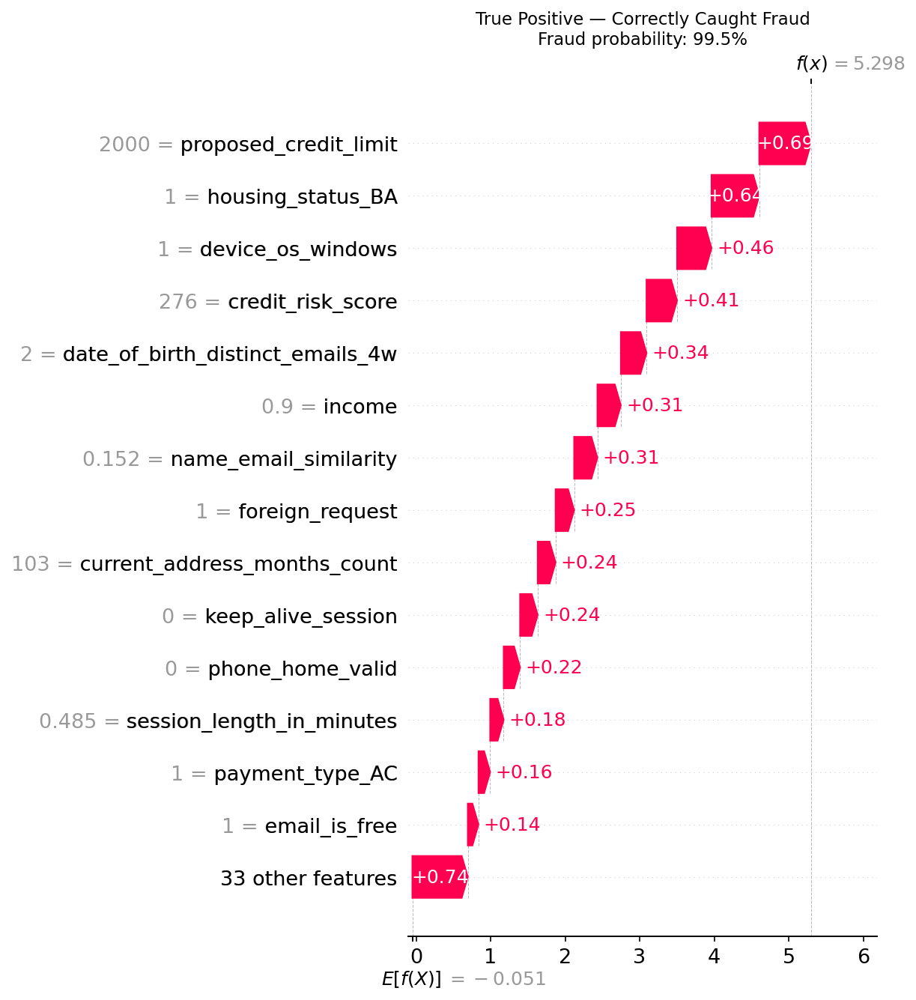

Fraud probability: 99.5%. Starting from the model's base value of -0.051, features stack to reach f(x)=5.298. The dominant pushers toward fraud are `proposed_credit_limit=2000` (+0.67), `housing_status_BA=1` (+0.60), `device_os_windows=1` (+0.46), `credit_risk_score=276` (+0.41), and `date_of_birth_distinct_emails_4w=2` (+0.34). Multiple simultaneous high-risk signals fired together: private renter, high credit request, elevated bureau score, and multiple email accounts tied to the same date of birth. This is the model working as intended, combining individually weak signals into a strong collective judgment.

---

### SHAP Waterfall : False Negative (Fraud the Model Missed)

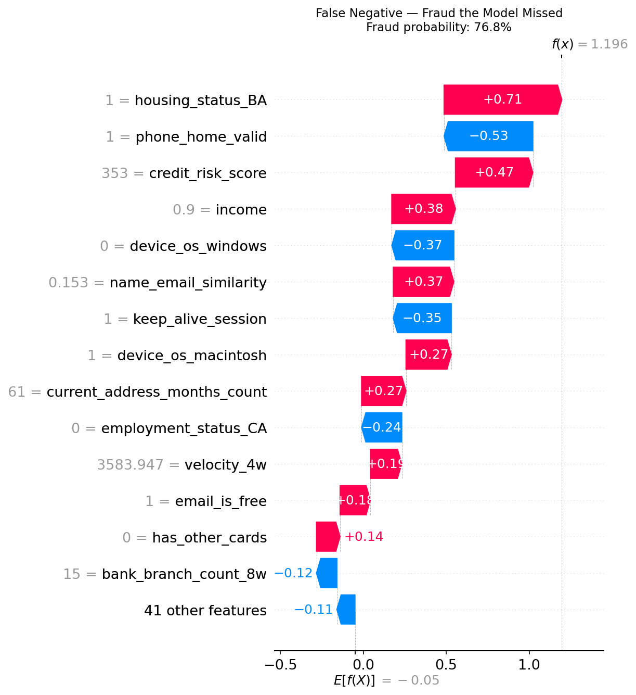

Fraud probability: 76.5%, which fell below the 5% FPR threshold of 0.7648. The model was on to it but got pushed back by strong legitimacy signals. `phone_home_valid=1` (-0.55) and `intended_balcon_amount=0.509` (-0.56) pulled the score down significantly. `housing_status_BE=1` (living with family, -0.38) and `housing_status_BA=0` (not a private renter, -0.37) reduced it further. The fraudster had a valid landline and was not a private renter, which are two strong legitimacy signals that masked the other red flags. This is the classic camouflage pattern where one or two strong legitimate signals offset multiple weaker fraud signals. At the cost-based threshold (0.5187), this case would have been caught.

---

### SHAP Waterfall : False Positive (Legitimate Application Wrongly Flagged)

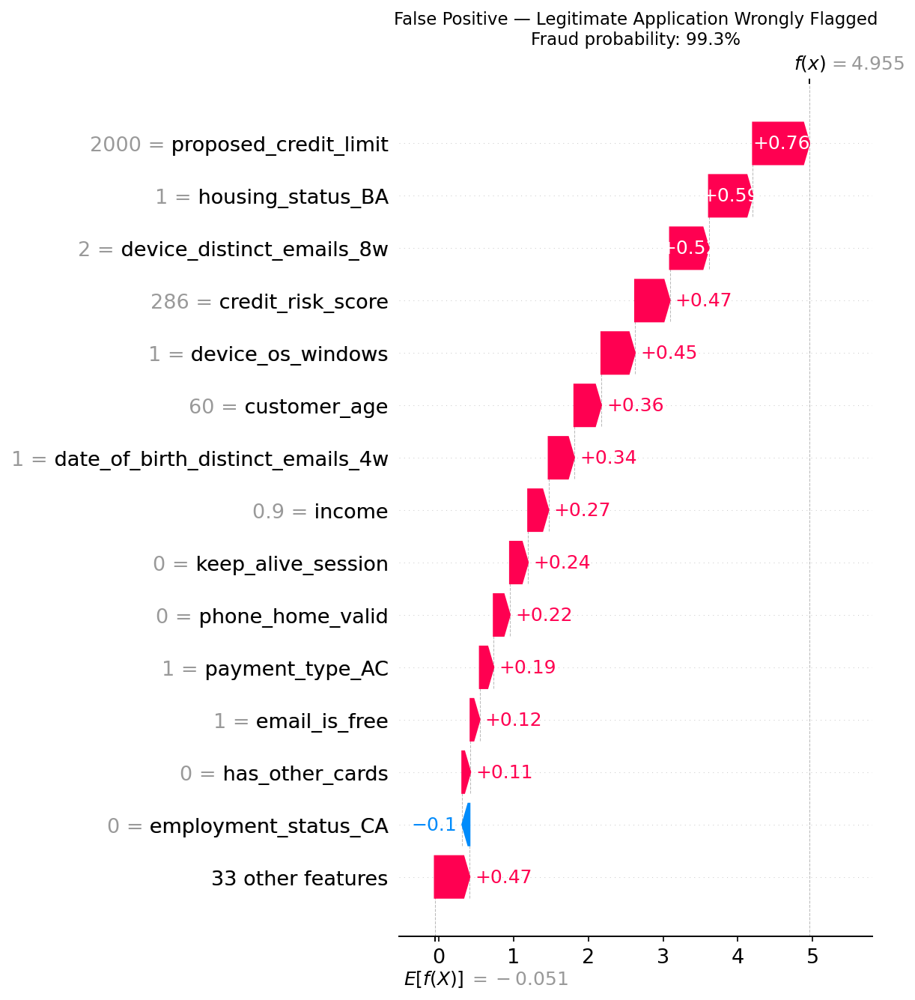

Fraud probability: 99.3% on a legitimate application. The waterfall shows an unavoidable overlap problem: `proposed_credit_limit=2000` (+0.79), `housing_status_BA=1` (+0.53), `device_distinct_emails_8w=2` (+0.50), `credit_risk_score=286` (+0.47), `device_os_windows=1` (+0.45). This legitimate applicant was a private renter requesting high credit with a slightly elevated bureau score and multiple email addresses on their device. Without additional information the model does not have access to, this profile is indistinguishable from the true positive. It is the irreducible cost of operating at high recall, and it is exactly why the false positive cost ($20 per manual review) was explicitly built into the threshold decision rather than ignored.

---

## How to Reproduce

```bash
# 1. Install dependencies
pip install -r requirements.txt

# 2. Place Base.csv at main/Base.csv

# 3. Run the pipeline in order, from main/code/
cd main/code
python src/preprocess.py
python src/train.py
python src/evaluate.py
python src/explain.py
```

---

## Requirements

```
pandas
numpy
scikit-learn
xgboost
imbalanced-learn
shap
matplotlib
scipy
joblib
```

---

## Key Design Decisions

| Decision | What | Why |
|---|---|---|
| Temporal split | Months 0-5 train, 6-7 test | Preserves time order. A random split would leak future data into training. |
| Scaler fit on train only | MinMaxScaler fitted on X_train, transform-only on X_test | Test distribution must not influence training statistics |
| 6 columns dropped | Velocity, zip count, branch count, device fraud | Synthetic artifacts with inverted or impossible values and no interpretable signal |
| XGBoost over LightGBM | Native pred_contribs SHAP, well-documented scale_pos_weight | LGBM is comparable in performance. XGBoost was chosen for exact built-in SHAP and established fraud detection precedent. |
| scale_pos_weight = 89.7 | Fraud cases weighted 89.7x during training | Corrects 89:1 class imbalance without modifying the data distribution |
| Grid search scored on recall | Hyperparameters tuned to maximize fraud catch rate | Recall is the primary business metric. Missing fraud is costly. |
| Stratified K-Fold | Each CV fold preserves original 1.1% fraud rate | Random folds could produce near-zero fraud cases per fold |
| Cost-based threshold at 51.87% | Derived from 50:1 FN/FP cost ratio using ACFE and LexisNexis benchmarks | Financially justified operating point, not statistically arbitrary |
| SHAP over gain importance | Native pred_contribs=True for per-prediction explanations | Gain is biased and global. SHAP is unbiased, directional, and per-prediction. |
